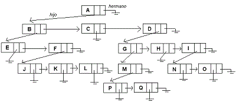

# Algoritmos y Estructuras de datos II
_Portafolio de algoritmos II Universidad Católica del Uruguay._

En este curso se aprendió a:

- Identificar y aplicar técnicas apropiadas para el diseño de algoritmos de computación para la resolución de problemas.

- Describir, analizar, implementar y aplicar diferentes algoritmos y estructuras de datos para la resolución de problemas que puedan ser resueltos utilizando:
    - Arboles genéricos

        

    - Grafos

        

    - Técnicas de ordenación
        - ShellShort
        - Burbuja
        - QuickSort
        - HeapSort
        - Bucket y RadixSort
        - Selección | Inserción directa

        

- Desarrollar programas de computación en Java 8 para el desarrollo del curso con el IDE NetBeans, cumpliendo con estándares básicos de calidad de software y aplicando técnicas modernas de desarrollo de software, globalmente aceptadas en la industria moderna.

- Expresar efectivamente propuestas de desarrollo y soluciones de software a problemas reales, en forma escrita y oral, argumentando de manera sistematizada sobre diferentes opciones existentes.

- Trabajar efectivamente en un equipo de personas para el análisis y solución de problemas mediante aplicaciones de software.